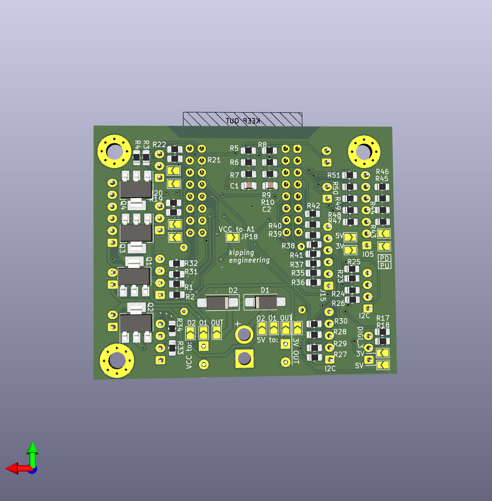

# ESP32S2_Wemos_PCB
Handy adapter to make use of all the IO.
ESP Devices have so many nice interfaces. This PCB adds:
- protection due to dumbness (serial 100Ohms save you electronics big time)
- nice plugs XH plugs work great
- protect against magic smoke from dumb inverse power
- add MosFETs to switch fast and reliable without extra hardwere
- select different power levels for connectors with solder jumpers

This is a Kicad project, feel free to improve. Or just upload the pcb file to the manufacturer you like

